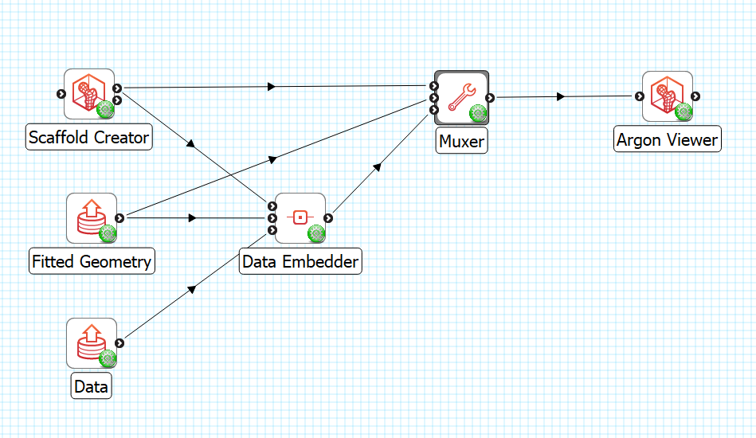

Muxer
=====

Overview
--------

The **Muxer** is a MAP Client plugin for muxing together multiple inputs into a list.

Workflow Connections
--------------------

The **Muxer** can have a various number of a user defined type of input. The number and type can be set in config. And the output would be a flattened *list-of* the user defined type. 

For example, :numref:`fig-mcp-muxer-workflow-connections` shows a workflow connection uses 3 *https://opencmiss.org/1.0/rdf-schema#file_location* type of inputs.

.. _fig-mcp-muxer-workflow-connections:

   **Muxer** workflow connections.

Configure
---------

Some care must be taken when configuring this step because it programmatically manipulates the step ports.
Because of this we **must** configure the *Mux type* parameter **and** *Number of inputs* parameter **before** we make connections to the step.
Existing connections will not be maintained if either of these two parameters are modified after the fact, resulting in the need to delete and redo connections involving the step.

The *Mux type* parameter should be a port type, for example: 'http://physiomeproject.org/workflow/1.0/rdf-schema#file_location'.
The *Number of inputs* parameter should be set to the number of inputs to mux together.

.. _fig-mcp-muxer-configure-dialog:

.. figure:: _images/step-configuration-dialog.png
   :alt: Step configure dialog

   *Muxer* step configuration dialog.

The step will accept either single inputs or list of inputs for each port.
All list inputs will be expanded on output so that the resulting output will be a single level list.
